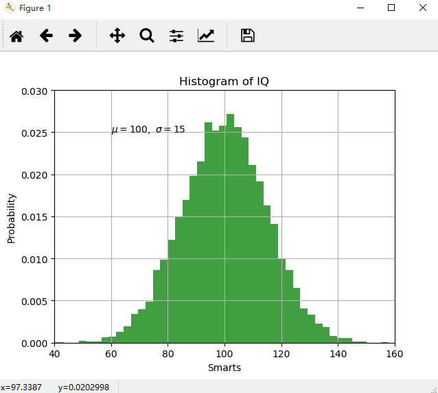

# 3 数据可视化Matplotlib和Pylot

## 3.1 Matplotlib数据可视化直方图

示例：

	import numpy as np
	import matplotlib.pyplot as plt
	
	mu, sigma = 100, 15
	data_set = mu + sigma * np.random.randn(10000)
	
	# the histogram of the data
	n, bins, patches = plt.hist(data_set, 50, normed = 1, facecolor = 'g', alpha = 0.75)
	
	plt.xlabel('Smarts')
	plt.ylabel('Probability')
	plt.title('Histogram of IQ')
	plt.text(60, .025, r'$\mu=100, \ \sigma=15$')
	plt.axis([40, 160, 0, 0.03])
	plt.grid(True)
	plt.show()

 

